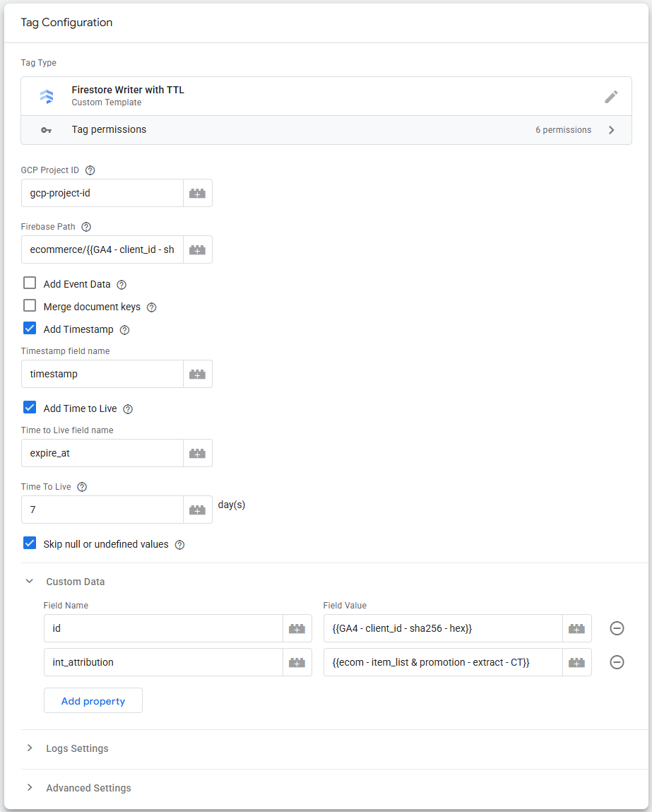

# Firestore Writer with TTL (Time To Live) Tag

**Firestore Writer with TTL** Tag makes it possible to write data from [**Server-side Google Tag Manager**](https://developers.google.com/tag-platform/tag-manager/server-side/overview) to [**Firestore**](https://cloud.google.com/products/firestore).

The unique function with this Tag is that it allows you to write [**TTL (Time To Live)**](https://firebase.google.com/docs/firestore/ttl) directly to Firestore from Server-side GTM.

## Functionality

* **Add Event Data**: Send all sGTM event data to the Firestore document
* **Merge document keys**: Merge keys into Firestore documents
* **Add Timestamp**: Adds timestamp in milliseconds
* **Add Time to Live**: Adds TTL (Time To  Live) Date and Time

Since [**Server-side GTM Firestore API**](https://developers.google.com/tag-platform/tag-manager/server-side/api#firestore) cannot directly utilize the standard to set **TTL**, this custom Template sends data directly to the [**Firestore API**](https://cloud.google.com/firestore/docs/reference/rest/v1/projects.databases.documents) using the **sendHttpRequest** function. Additionally, because the Server-side GTM API lacks native **Date** object support, the Template includes its own custom date-math routine to accurately create and manage dates.

The functionality and look of the Tag Template is somewhat similar to the [Firestore Writer Tag](https://github.com/stape-io/firestore-writer-tag), and some elements have been borrowed from that Template.
